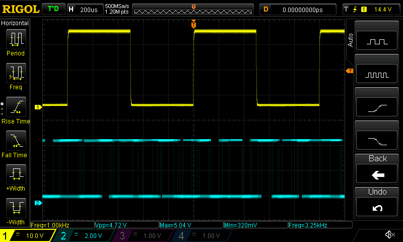
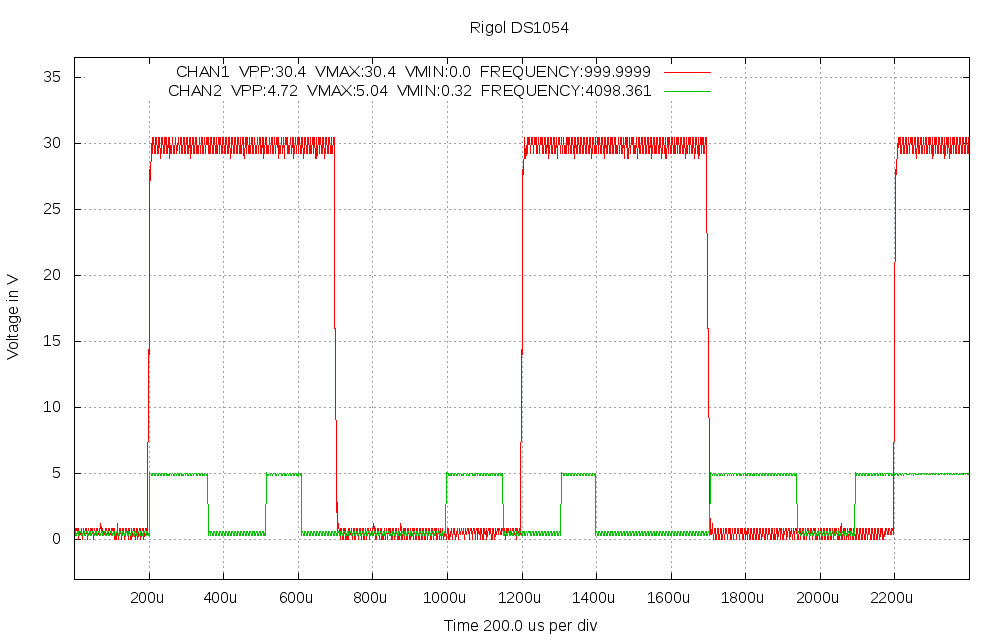

# scopeio
Small utility to get screen dumps and measured data from Rigol DS1054 oscilloscope, using vxi11 software transport over Ethernet. Controlling the oscilloscope is possible, so any gui could be build over the vxi11 transport, but for now this is just a command line tool.

# How it works

It uses very little modified github project https://github.com/applied-optics/vxi11 program vxi11_cmd as transport, the needed patch is in src/vxi11_cmd_changes.patch. The higher level is python code written for the project, it uses python-pexpect, python-numpy and python-gnuplot packages at least.

Different from other similar programs this stores the output to files and only  optionally shows them by desired external program.

The screendumps will always be in .bmp format as the data comes as is from the oscilloscope itself.

The processed outputs can now be taken as .png or .svg format, but of course gnuplot can be modified to generate more options. Also the look of the processed output is very basic, it would need someone knowing gnuplot better to have much nicer pictures.

Examples of the output files are in pictures directory.

# Usage

Here is the help from the python program:

```
Usage: scopeio.py [--nomeas] [--nomodes] [--mode=state] [--after=state]
     [--help] [--prefix=namestart] [--view=program] [--format=<fmt>] 
     [--screen] [--noscreen] [--addr=a.b.c.d] [--config=filename]
     [--size=xsize,ysize] [channels] ... [channels]

Default prefix is "scope".
Formats supported now: png (default) and svg.
Setting --nomodes means that scope is not stopped or run during capture.
Setting --mode=STOP or --mode=RUN is mode for measurement time and similarly
--after=STOP or --after=RUN is mode left on after measurement. Default is
not to change scope mode.
Default size is 1000,640 pixels, can be for example by --size=800,480, this
does not affect the screendump, which is always 800,480 from the scope

Examples:
  scope --nomeas --view=mirage 1           -- ch1 shown in mirage with no measurements (faster)
  scope 12 34 13 23  --prefix=myfile       -- ch1/ch2 ch3/ch4 ch1/ch3 ch3/ch4 images done
  scope --view=gimp 1234 --format=svg      -- all 4 channels in svg and send to gimp
  scope --screen --mode=STOP               --- take only display screen dump, STOP the scope
  scope --screen 12 --nomodes              --- take screen dump and two channel graph, no STOP/RUN
  scope --addr=192.168.1.100 1 --noscreen  --- scope ip address set, no screen capture
  scope --config=~/.scopeio.myconfig       --- alternate config file, default is ~/.scopeio

Default config file is  ~/.scopeio, all above settings can be there, one per line, same syntax,
lines starting with # are taken as comments.

```

# Examples

Pictures in pictures directory are made by next two command examples:

./scopeio.py --screen 12 --view=mirage





./scopeio.py --noscreen 1 2 1234 --format=svg --view=gimp


Note that scalings vary as different channels are shown. 
For same display as in oscilloscope the screendump works better.
