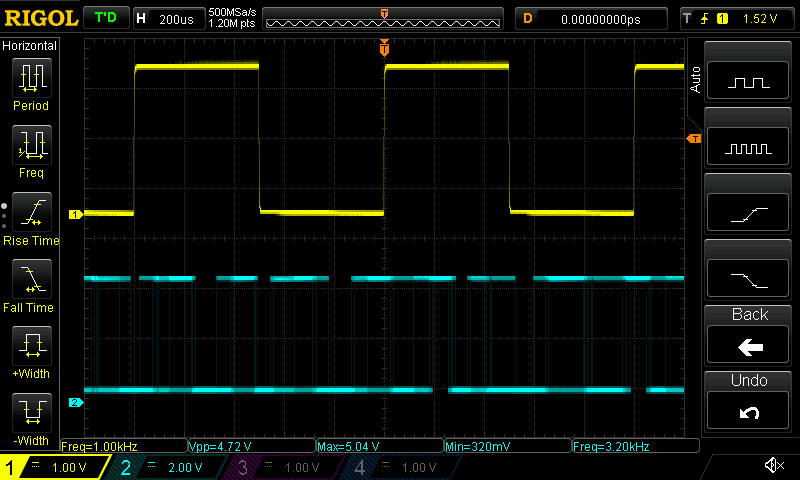
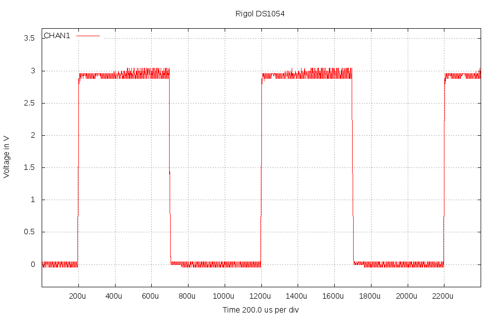
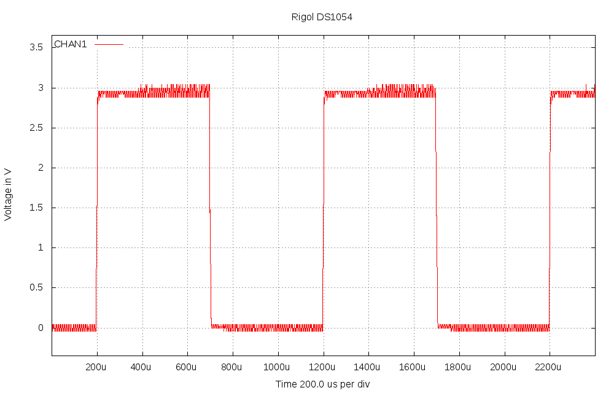
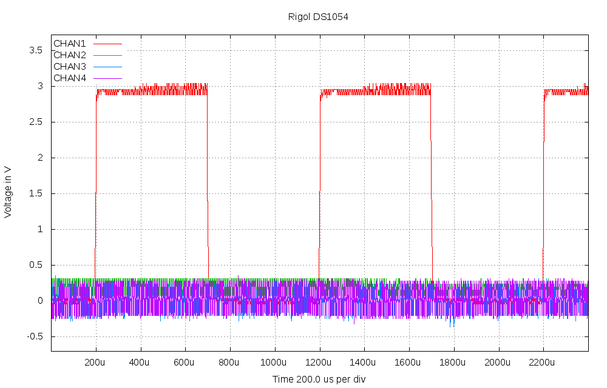

# scopeio
Small utility to get screen dumps and measured data from Rigol DS1054 oscilloscope, using vxi11 software transport over Ethernet.
Controlling the oscilloscope is possible, so any gui could be build over the vxi11 transport, but for now this is just a command line tool.

Obviously there is not so much to do as the transport below is works with very litte buffer size issue and now no code in vxi11 needs changes, python interface is separate. 

Also the scope does make screendump in bmp format, just need to store it. And the scope does do the scaling of waveform too in ASCII mode, so the needed math is very minimal.

Starting from version v0.3 the inteface between vxi11 code and python is converted to be shared library created by swig. So there is python module called vxi11 with very primitive first interface, just enough to make single instrument handling work. But this way system is much faster (waveform take is less than one second mithout measurements) and also much less error prone. The speed could still be improved easily as data is read from python one byte at a time, but anyway the screendump at least takes time on the scope much more than receiving the result.

# How it works

It uses github project https://github.com/applied-optics/vxi11 as transport. The higher level is python code written for the project, it uses python-pexpect, python-numpy and python-gnuplot packages at least. The interface between vxi11 C/C++ code and python is impemented by swig and for now it is very basic one. The vxi11 code and pythoin interface are buils as python module and it is installed with pip. The capture example program is installed in /usr/local/bin by default.

Different from other similar programs this stores the output to files and only optionally shows them by desired external program. But the capture python script is just an example, you could control all features of the scope and maybe other scopes and instruments as well.

# Used formats

The screendumps will always be in .bmp format as the data comes as is from the oscilloscope itself.

The processed outputs can now be taken as .png or .svg format, but of course gnuplot can be modified to generate more options.

Also the look of the processed output is very basic, it would need someone knowing gnuplot better to have much nicer pictures.

Examples of the output files are in images directory.

# Usage

Here is the help from the python program:

```

Usage: scopeio.py [--nomeas] [--nomodes] [--mode=state] [--after=state]
     [--help] [--prefix=namestart] [--view=program] [--format=<fmt>] 
     [--screen] [--noscreen] [--addr=a.b.c.d] [--config=filename]
     [--size=xsize,ysize] [channels] ... [channels]

Default prefix is "scope".
Formats supported now: png (default) and svg.
Setting --nomodes means that scope is not stopped or run during capture.
Setting --mode=STOP or --mode=RUN is mode for measurement time and similarly
--after=STOP or --after=RUN is mode left on after measurement. Default is
not to change scope mode.
Default size is 1000,640 pixels, can be for example by --size=800,480, this
does not affect the screendump, which is always 800,480 from the scope

Examples:
  scopeio.py --nomeas --view=mirage 1           -- ch1 shown in mirage with no measurements (faster)
  scopeio.py 12 34 13 23  --prefix=myfile       -- ch1/ch2 ch3/ch4 ch1/ch3 ch3/ch4 images done
  scopeio.py --view=gimp 1234 --format=svg      -- all 4 channels in svg and send to gimp
  scopeio.py --screen --mode=STOP               --- take only display screen dump, STOP the scope
  scopeio.py --screen 12 --nomodes              --- take screen dump and two channel graph, no STOP/RUN
  scopeio.py --addr=192.168.1.100 1 --noscreen  --- scope ip address set, no screen capture
  scopeio.py --config=~/.scopeio.myconfig       --- alternate config file, default is ~/.scopeio

Default config file is  ~/.scopeio, all above settings can be there, one per line, same syntax,
lines starting with # are taken as comments.

```

There are some new features now, the STOP/RUN of scope can be used or not, the image sizes can be set and so on.

# Examples

Pictures in pictures directory are made by next two command examples:

./scopeio.py --screen 12 --view=mirage




./scopeio.py --noscreen --nomeas 1 1 1 1 1 1 1 1 1 1 1234





Without the default measurements the taking of waveform is under one second, time between the ten is 8 seconds.
With the four measurements (VPP, VMAX, VMIN and FREQUENCY) the time for one measuremnt is around 2 seconds.



Note that scalings vary as different channels are shown, because the measurement is not a screen capture, it is not scaled in y-axis, the scope calculates real value itself. So when channels have different amplitude, you may want them in separate pictures. Screendump is of course much better to get same display as in oscilloscope screen.

# File naming

```


Screendump:  <prefix>-<sequencenumber>-screendump-<date>-<time>.bmp

Measurement: <prefix>-<sequencenumber>-<channels>-<date>-<time>.[png | svg]

```
