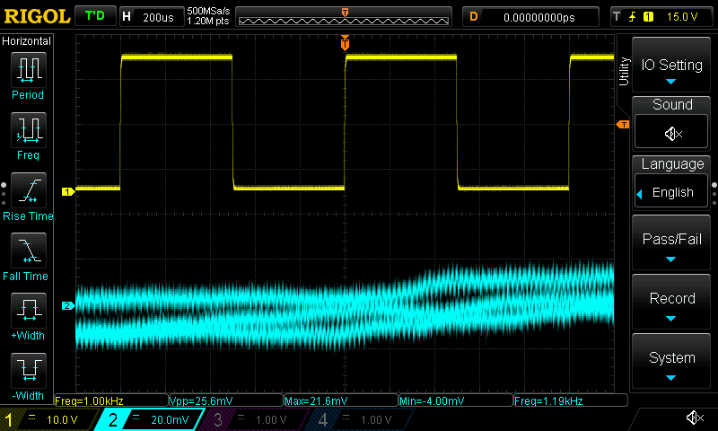
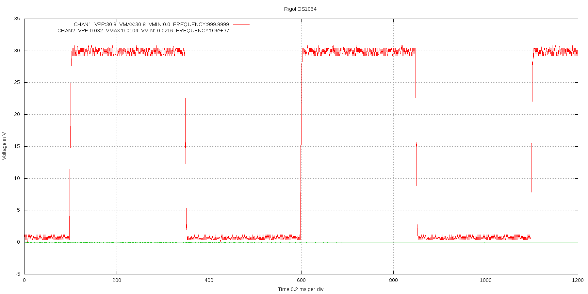
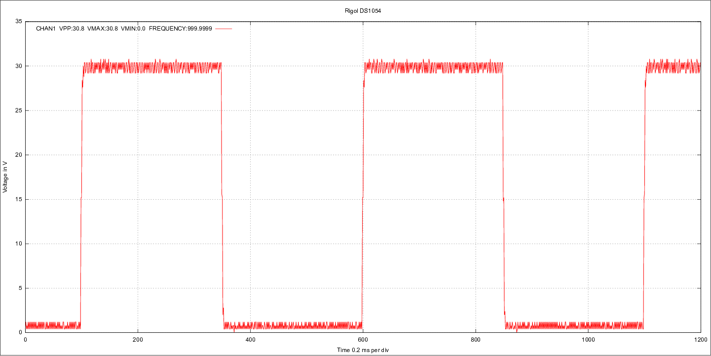
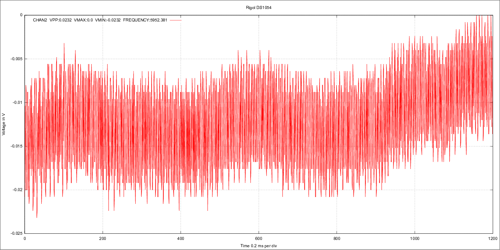
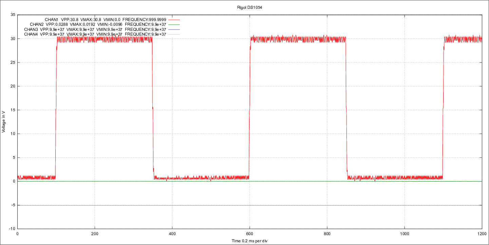

# scopeio
Small utility to get screen dumps and measured data from Rigol DS1054 oscilloscope, using vxi11 software transport over Ethernet.

# How it works

It uses very little modified github project https://github.com/applied-optics/vxi11 program vxi11_cmd as transport, the needed patch is in src/vxi11_cmd_changes.patch. The higher level is python code written for the project, it uses python-pexpect, python-numpy and python-gnuplot packages at least.

Different from other similar programs this stores the output to files and only  optionally shows them by desired external program.

The screendumps will always be in .bmp format as the data comes as is from the soscilloscope itself.

The processed outputs can now be taken as .png or .svg format, but of course gnuplot can be modified to generate more options. Also the look of the processed output is very basic, it would need someone knowing gnuplot better to have much nicer pictures.

Examples of the output files are in pictures directory.

# Usage

Here is the help from the python program:

```
Usage: scopeio.py [--help] [--nomeas] [--prefix=namestart] [--view=program] [--format=<fmt>] [--screen] [--noscreen] [--addr=a.b.c.d] [--config=filename] channels [channels] ... [channels]
Default prefix is scope
Formats supported now: png (default) and svg
Examples:
  scope --nomeas --view=mirage 1           -- channel1 shown in mirage with no measurements (faster)
  scope 12 34 13 23  --prefix=myfile       -- ch1/ch2 ch3/ch4 ch1/ch3 ch3/ch4 images done in png with measurements
  scope --view=gimp 1234 --format=svg      -- all 4 channels in svg and send to gimp
  scope --screen                           --- take only display screen dump
  scope --screen 12                        --- take screen dump and two channel graph
  scope --addr=192.168.1.100 1 --noscreen  --- scope ip address set, no screen capture even when config file has screen on
  scope --config=~/.scopeio.myconfig       --- alternate config file, default is ~/.scopeio

There can also be config file ~/.scopeio with all the settings, one per line with command line syntax
```

# Examples

Pictures in pictures directory are made by next two command examples:

./scopeio.py --screen 12 --view=mirage





./scopeio.py --noscreen 1 2 1234 --format=svg --view=gimp







Note that scalings vary as different channels are shown. 
For same display as in oscilloscope the screendump works better.
